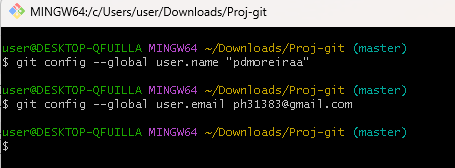
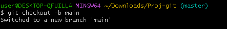

<h1> Leonardo dos Santos Pessanha e Pedro Henrique Moreira Silva</h1>

<h2>Abaixo os Prints e o passo a passo (As explicações vem abaixo das imagens)</h2>

Primeiramente damos um nome e descrição para o novo repositório e adicionamos o readme
 

Agora vamos em settings e em collaborators para adicionar a nossa dupla
 

Indo para o explorador de arquivos vamos para a pasta que desejamos levar para o repositório e clicamos com o botão direito para abrir a pasta no git bash
 

Usamos esse comando para iniar o git na pasta
 

Esses dois códigos servem para conectar sua conta github com o git bash
 

Os dois servem para linkar o repositório com a pasta remota, sendo que o segundo código serve para trazer o conteúdo existente no repositório
 

Alternando a branch de trabalho para main
 

Aqui são os conjuntos de códigos para realizar um commit e vizualizar ele, sendo o git add . para adicionar e o git commit para escrever o seu commit. Por fim o git log para analisá-los
 

Esse comando é basicamente o contrário do git pull falado anteriormente, ele serve para levar os arquivos e alterações remotas para o repositório
 

Aqui vamos fazer alterações remotas, primeiro você seleciona o arquivo que deseja fazer alterações, realiza as alterações e clica em commit changes
 

Após isso você comenta suas alterações e salva o commit
 

Ele ficará assim no repositório
 

Para receber as alterações no remoto, usamos o git pull no git bash para recebê-los. Podemos dar um git log para ver se o commit foi recebido
 

Aqui realizaremos alterações locais, como no css, mostrado no exemplo
 

Agora repetimos o mesmo processo para adicionar um commit via Git Bash
 

Por fim, carregamos as alterações para o repositório
 

Repetindo esses processos, você pode realizar commits importar e exportar arquivos entre o repositório e o remoto sem problemas.

